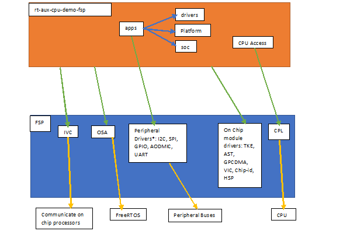

@mainpage Welcome

# Introduction #
Welcome to the <i>Jetson Sensor Processing Engine (SPE) Developer Guide</i>.

NVIDIA&reg; Jetson&trade;
provides a built-in Cortex-R5 micro-controller within an always-on
power domain known as Sensor Processing Engine (SPE) or AON Cluster. Example use cases
SPE may enable includes sensor data processing, wake up management, UAV, robotics.

SPE micro-controller has the following configurations:
- ARM V7-R ISA
- 32-kilobyte Instruction cache
- 32-kilobyte Data cache
- 256-kilobyte SRAM attached to TCM interface
- Vectored Interrupt
- 64-bit AXI master interface for DRAM request
- 32-bit AXI master interface for MMIO request
- 200MHz maximum and operating core clock speed

The number of SPE peripherals and their instances will vary based on the Jetson
platform.

The AON cluster includes the following peripherals:
- General purpose timers, Watchdog timer, Timestamp engine
- I2C, SPI, CAN, UART, GPIO, PWM
- DMIC (for voice wake functionality)

@note SPE Software Development Kit may not implement or provide support for all
the above peripherals.

For detailed information on the SPE,
see <i>NVIDIA Technical Reference Manual (TRM)</i> for the Jetson platform.

# Supported Features by Platform

|                 | AGX Xavier | AGX Orin |
|-----------------|:----------:|:--------:|
| AODMIC          | [x]        |    [x]   |
| GPIO            | [x]        |    [x]   |
| I2C             | [x]        |    [x]   |
| IVC             | [x]        |    [x]   |
| SC7-aodmic wake | [x]        |          |
| Timer           | [x]        |    [x]   |
| CAN             |            |          |
| GTE             |            |          |
| SPI             |            |          |
| UART            |            |          |

Only the above platforms are supported.

# The SPE BSP (Board Support Package) or SDK (Software development kit) #
The SPE firmware is FreeRTOS V10.4.3 based. The SPE release package has
following directory structure.
- fsp/source: This includes common drivers, operating system and CPU
abstraction layers. The FSP (firmware support package) details can be found at
[FSP](md_rt-aux-cpu-demo-fsp_doc_fsp.html). The relevant subdirectories are as
follows:
  - drivers: The common peripheral drivers.
  - include: Header files, includes drivers, CPL (CPU Abstraction Layer) and OSA
  (Operating System Abstraction) headers.
  - soc: The SOC (system on chip) specific source codes.
- rt-aux-cpu-demo-fsp: It includes demo peripheral apps, common drivers which
are not part of the fsp, platform specific source code.
  - app: Demo apps for the supported peripherals.
  - doc: Documents.
  - drivers: Common drivers which could not be part of the fsp/source.
  - include: Header files
  - platform: platform specific source code.
  - soc: The chip specific sources and header files.
  - FreeRTOSConfig.h: FreeRTOS config file.
  - main.c: The application entry point.
  - Makefile/target_specific.mk: The build system.
- FreeRTOSV10.4.3/FreeRTOS/Source: FreeRTOS source code.

## The SPE firmware layered view ##
The overall architecture is as described in below

- \*rt-aux-cpu-demo-fsp/app does not include all the peripheral demo apps.
  - There are multiple instances available for some peripherals as well on
  chip hardware modules, for that detail, please follow chip specific
  technical reference manual which should also list instance number falling
  under SPE/AON domain. AON stands for always on and it can be interchangeably
  used with SPE in this and other documents.
- Where,
  - IVC: Inter VM Communication, used to communicate with other on chip
  processors through memory channels.
  - TKE: Time Keeping Engine; follow SOC Technical reference manual for
  more details.
  - AST: Address Space Translation Unit; follow SOC Technical reference
  manual for more details.
  - HSP: Hardware Synchronization Primitives; follow SOC Technical reference
  manual for more details.
